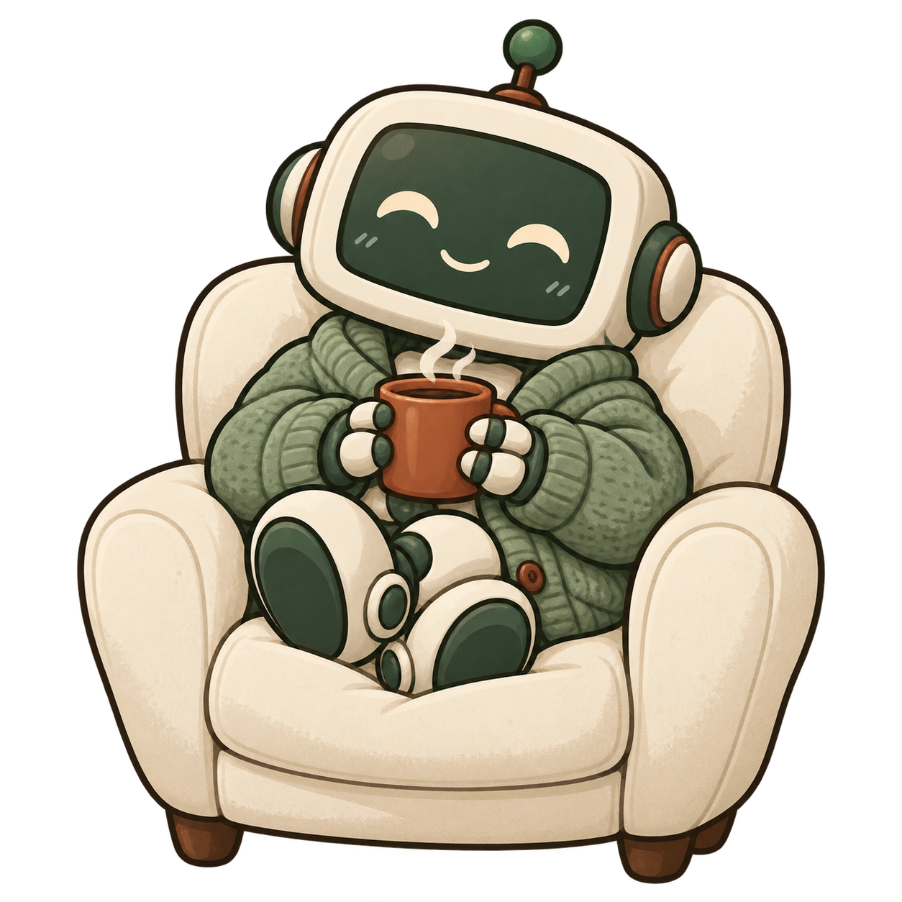
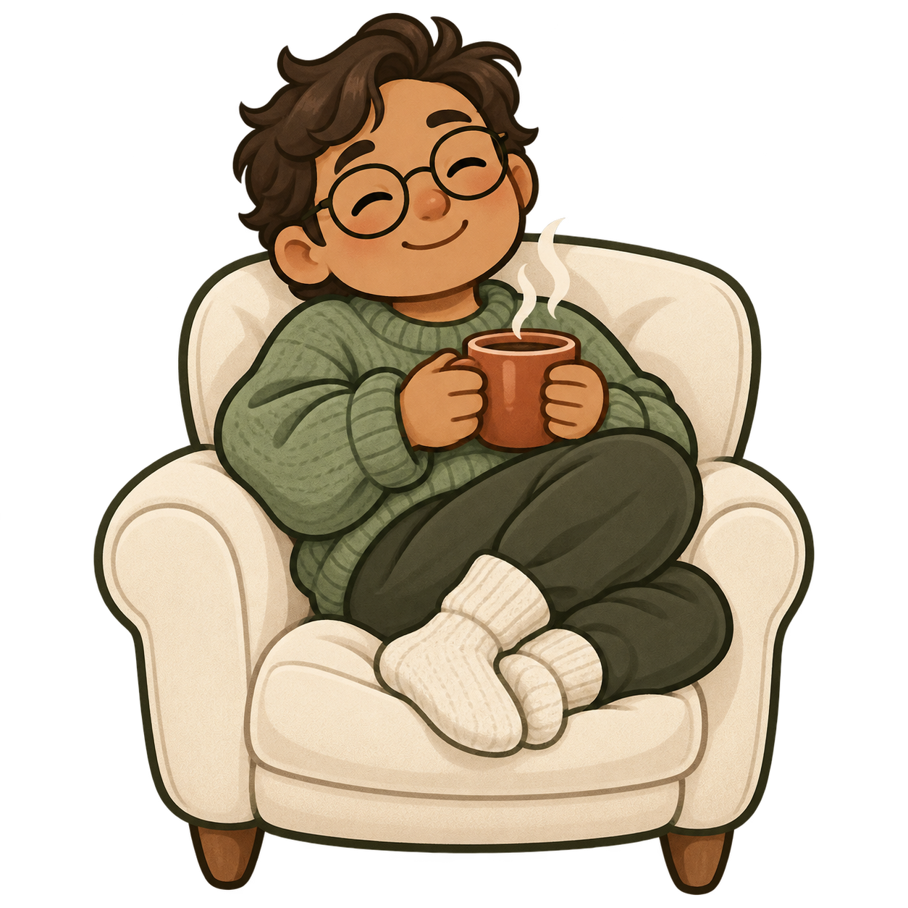

# Comfyware mascot options

Two preview concepts requested after the bear: a comfortable little robot and a
comfortable person. Both take their friendly outlines, simple faces, and soft
shading from Imvault's keeper and Witmoot's Moot Knight. Neither option replaces
the homepage mascot until a direction is selected.

Generated with the built-in `image_gen` tool on 2026-09-28. These PNGs are saved
unchanged from the generated outputs, preserving their transparent backgrounds.

## Option 1: the off-duty robot



### Generation prompt

```text
Use case: illustration-story
Asset type: a mascot concept option for comfyware.org, an independent collection of friendly, small, open-source apps. The user is choosing between a little robot and a person and rejected animal mascots.
Style: a polished, friendly software mascot with a clear rounded silhouette, confident dark green/brown outlines, simple expressive eyes and a gentle curved smile. Clean layered colors, softly shaded forms, subtle restrained texture. Inspired by the visual language of the Imvault keeper (a round blue vault with thick dark outlines, dot eyes, simple smile and little hands/feet) and Witmoot's Moot Knight (a cheerful chibi knight with a simple face, sage-and-cream colors, warm brown furniture and soft cel shading). Make this illustration feel like a companion to those characters, not a realistic portrait or a fuzzy watercolor painting.
Composition: one complete character in a compact cream armchair, centered, full character and chair visible with generous transparent margins, square canvas. Readable at 250–350 pixels wide. The posture and expression should make it immediately obvious that this character is EXTREMELY comfortable and content, taking an unhurried coffee break.
Palette: moss green #355746, soft sage, warm cream #f7f5ed, warm brown, and a terracotta #984629 ceramic coffee mug.
Background: genuinely transparent alpha background, no opaque rectangle, no checkerboard baked into the image, no room, no ground plane.
Constraints: no text, letters, logo, watermark, border, extra characters, animals, bears, mice, decorative floating symbols, laptop, work equipment or scenery. One clear mug of coffee, held naturally, with two small steam curls. Deliver one finished mascot concept.
Subject: an adorable LITTLE ROBOT, visibly mechanical but soft and approachable in design. Rounded cream-painted rectangular head with small round side joints and a tiny stub antenna, a dark sage face display with simple warm-cream sleepy eyes and a gentle happy smile. Compact rounded body, short articulated hands and feet. Wearing an oversized sage-green knitted cardigan, loosely bundled into the cream armchair with both feet drawn comfortably onto the cushion. Both small robot hands cradle the warm terracotta mug. Let the head lean slightly into the chair and the shoulders relax. Clearly a robot taking a very cozy break, not an animal in a robot suit. Its mechanical identity must remain clear through its face, hand joints and little rounded feet. Charming clean cartoon design; avoid busy machinery, circuitry, chrome realism, sharp angles, or a huge futuristic helmet.
```

## Option 2: the armchair regular



### Generation prompt

```text
Use case: illustration-story
Asset type: a mascot concept option for comfyware.org, an independent collection of friendly, small, open-source apps. The user is choosing between a little robot and a person and rejected animal mascots.
Style: a polished, friendly software mascot with a clear rounded silhouette, confident dark green/brown outlines, simple expressive eyes and a gentle curved smile. Clean layered colors, softly shaded forms, subtle restrained texture. Inspired by the visual language of the Imvault keeper (a round blue vault with thick dark outlines, dot eyes, simple smile and little hands/feet) and Witmoot's Moot Knight (a cheerful chibi knight with a simple face, sage-and-cream colors, warm brown furniture and soft cel shading). Make this illustration feel like a companion to those characters, not a realistic portrait or a fuzzy watercolor painting.
Composition: one complete character in a compact cream armchair, centered, full character and chair visible with generous transparent margins, square canvas. Readable at 250–350 pixels wide. The posture and expression should make it immediately obvious that this character is EXTREMELY comfortable and content, taking an unhurried coffee break.
Palette: moss green #355746, soft sage, warm cream #f7f5ed, warm brown, and a terracotta #984629 ceramic coffee mug.
Background: genuinely transparent alpha background, no opaque rectangle, no checkerboard baked into the image, no room, no ground plane.
Constraints: no text, letters, logo, watermark, border, extra characters, animals, bears, mice, decorative floating symbols, laptop, work equipment or scenery. One clear mug of coffee, held naturally, with two small steam curls. Deliver one finished mascot concept.
Subject: a cute stylized ADULT PERSON with a softly rounded face, tousled short dark-brown hair, small round glasses, warm medium skin tone and a relaxed, contented smile. A slightly oversized head in the same friendly illustrated mascot language as the Moot Knight, but visibly an adult rather than a baby. Wearing a roomy sage-green knitted sweater and cream wool socks, shoulders relaxed, nestled deeply into the cream armchair with feet comfortably tucked onto the cushion. Both hands wrapped around the warm terracotta coffee mug. The face has soft sleepy eyes and a welcoming, easygoing expression. The silhouette should read as someone who has found the comfiest seat in the house. Keep the outfit and face simple and recognizable at small sizes. No armor, fantasy costume, animal features, or exaggerated caricature.
```
